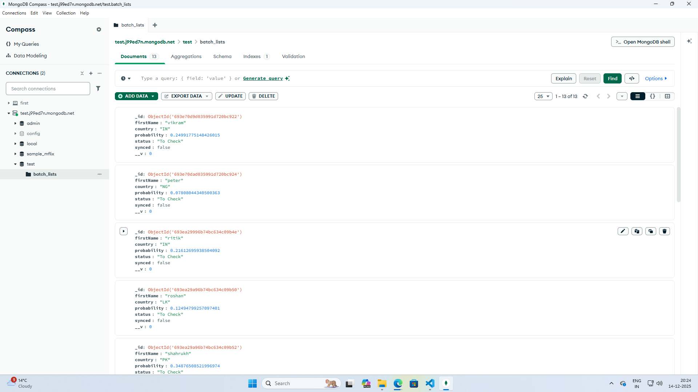

# Smart Lead Automation System

This dashboard allows users to submit a batch of first names and view processed results including predicted country, confidence score, and processing status.  
The backend efficiently handles batch API requests and avoids duplicate background processing.

---

## Tech Stack

- **Frontend:** React, Bootstrap
- **Backend:** Node.js, Express.js
- **Database:** MongoDB (Mongoose)
- **External API:** Nationalize.io API (`https://api.nationalize.io?name=X`)
- **API Calls:** Fetch API

---

## Setup Instructions

### Clone the Repository
```bash
git clone https://github.com/<your-username>/smart-lead-automation.git
cd smart-lead-automation

# Backend Setup

```bash
cd backend
npm install
npm run dev


# Frontend Setup

```bash
cd frontend
npm install
npm run dev

```

## Architectural Explanation

# Batch API Handling

The frontend sends a POST request containing an array of names.

The backend processes names asynchronously.

Each name is processed independently to avoid blocking the request cycle.

Results are stored in database and returned efficiently.

# preventing duplicate syncs in the background task

Before saving data in database each enteries marked with default property synced false.

If a name is already being processed or synced, it is skipped.

This prevents duplicate syncs in the background task.

Background tasks run smoothly without any inturruption.

#Database Screenshots



# Deliverables

Live Frontend URL:https://smart-lead-automation-frontend.onrender.com

Live Backend API URL:https://smart-lead-automation-3wlz.onrender.com/api/names

